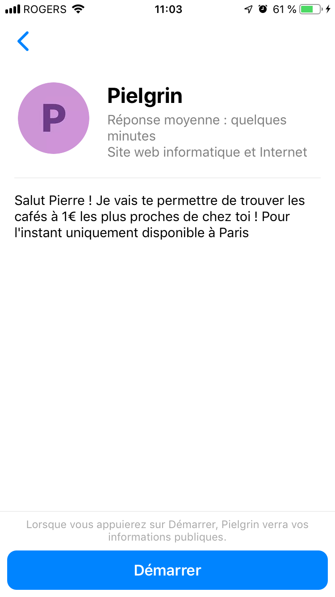
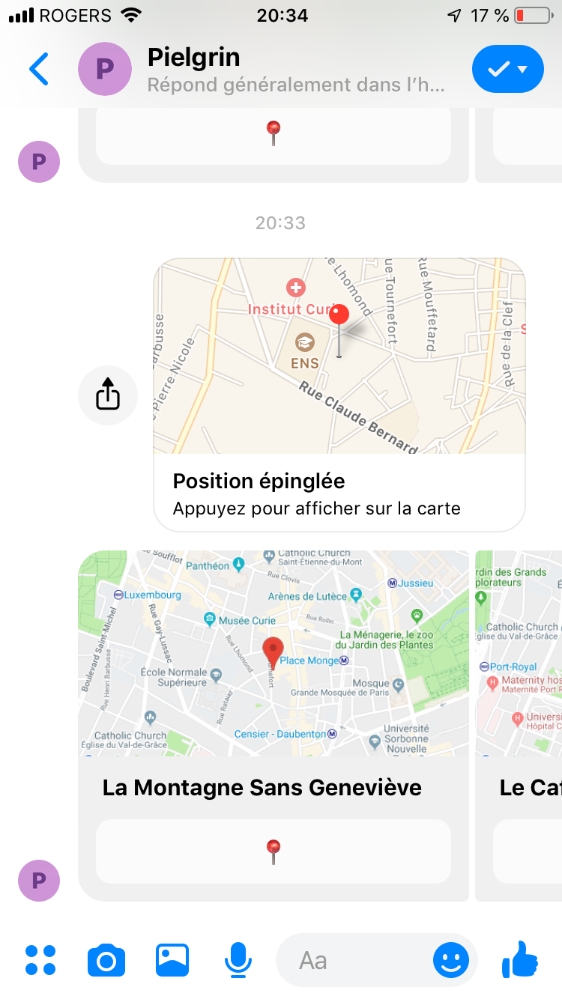

# cafe-1-euro-bot

This project is a facebook messenger chatbot that drive you to the closest 1€ café.
Data provide from this dataset https://www.data.gouv.fr/fr/datasets/liste-des-cafes-a-un-euro-prs/ listing all places in Paris where you can buy a coffee for 1 euro.

Please refer to this tutoriel if you want to submit your chatbot to facebook messenger platform : https://medium.com/crowdbotics/how-to-create-your-very-own-facebook-messenger-bot-with-dialogflow-and-node-js-in-just-one-day-f5f2f5792be5.

Small talk is enable thanks to Dialogflow API.

/!\ Unfortunately, Facebook has deprecated the location quick reply function on July 29, 2019. Therefore this project can't work anymore. /!\ 

Screenshots: 

